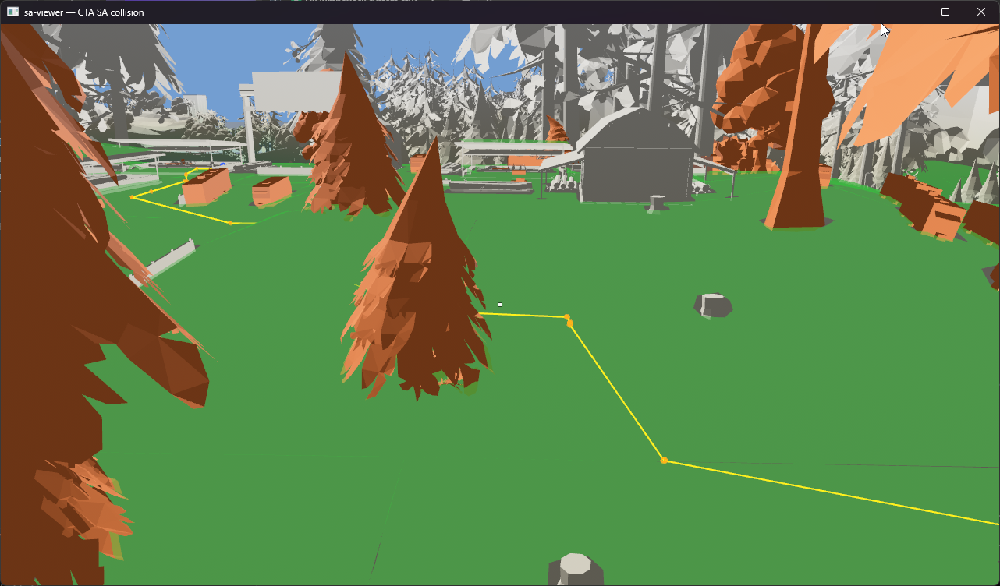

# RakClient: a headless async SA-MP 0.3.7 client (Rust / Tokio)

RakClient is a headless, autonomous SA-MP 0.3.7 client for writing in-game scenarios. There is no GTA
San Andreas, no game engine, and no rendering. A normal SA-MP client is GTA:SA plus `samp.dll`;
RakClient never launches the game and speaks the wire protocol directly. The protocol was
reverse-engineered from `RakSAMP Lite.exe`, so it connects to a real 0.3.7 server, plays through the
whole connection-to-spawn sequence, and then runs whatever you script for it: jobs, automation, a chat
bridge, or anything else you write in Lua.

```
Disconnected -> Connecting -> RakNet-connected -> Joining (ClientJoin)
-> Joined (InitGame) -> ClassSelection -> ClassSelected -> Spawned -> InGame (on-foot sync)
```

You write behaviour as Lua (Luau) scripts against a host API that mirrors MoonLoader / SAMP.Lua, so a
script hooks every RPC and packet the same way it would inside the real game. Under that sits the
SA-MP "RakNet 3.x" reliable/ordered UDP transport, the per-datagram byte cipher, and the connection
state machine.

[Документация на русском](README.ru.md)

## Walking like a real player

The bot moves over a real navigation mesh built from the server's own map, and it walks with the
GTA-SA gaits: walk, jog, and sprint, at speeds and animations measured from a live capture of the game
client (`walkTo(x, y, z, "walk"|"jog"|"sprint")`). A script asks it to go somewhere and it finds a
path around the props and buildings, reporting a matching analog input, velocity, and animation so it
reads as a genuine player to everyone else on the server.

Below is the offline viewer showing Arizona RP's sawmill, reconstructed from the game files, with a
navmesh route (yellow) planned across the yard. The green carpet is the walkable surface.




## Workspace layout

| Crate | Responsibility |
| --- | --- |
| `samp-proto` | Pure codecs: `BitStream`, packet/RPC ids, typed (de)serializers. No I/O. |
| `raknet` | RakNet 3.x transport: byte cipher, reliability layer, async `RakPeer`, plus an offline pcap dissector. |
| `samp-client` | Connection state machine, the high-level `Client`, and the native `walkTo` walker. |
| `samp-script` | Luau scripting host: `bitStream` + `registerHandler` natives and a typed `samp.events` port. |
| `sa-map` | Parser for GTA/Arizona world data (IMG, IDE, IPL, COL, DFF, the streamer bin) and a baked-scene format. |
| `sa-nav` | Navmesh generation (`navgen`) over `navmesh-recast`, the `.nav` format, and runtime pathfinding. |
| `navmesh-recast` | The Recast build pipeline (a fork of `rerecast`); machine-local until published. |
| `sa-viewer` | A Bevy flythrough of the parsed world and the navmesh. Its own workspace, to keep Bevy out of the main gate. |
| `app` | Binary (`rakclient`): config, tracing, and the `dissect` / `objects` / `rpcscan` capture tools. |
| `test-support` | Dev-only fixtures and a loopback mock SA-MP server for integration tests. |

## Run

```sh
cargo run -p app -- --server <host:port> --nick <Nick> [--scripts-dir example_scripts]
```

The binary is `rakclient`, not the crate name `app`. Set `RUST_LOG=info` for logs, or
`raknet::transport=trace` to see every datagram as hex. Pass `--navmesh <file.nav>` to enable the
native `walkTo` walker in scripts.

## World and navigation tools

The bot lives on Arizona's custom map, so a few tools reconstruct and navigate it offline.

Bake the world once, then view it:

```sh
cargo run -p sa-map --bin samap -- scene <gta3.img> <data-dir> world.scene [objects.csv]
cargo run --release --manifest-path crates/sa-viewer/Cargo.toml -- world.scene [nav.nav]
```

Build a navmesh for a region (the bot walks over it via `walkTo`):

```sh
cargo run -p sa-nav --features build --bin navgen -- <gta3.img> <data-dir> region.nav [objects.csv]
```

Capture and inspect traffic. `rakclient --pcap` writes a libpcap file; the MoonLoader script at
`tools/moonloader/rpc_capture_pcap.lua` writes the same format from the real client. Both open in the
offline tools:

```sh
cargo run -p app --bin dissect -- capture.pcap   # per-datagram RPC/packet decode
cargo run -p app --bin objects -- capture.pcap   # extract streamed CreateObject placements
cargo run -p app --bin rpcscan -- capture.pcap   # RPC/packet census + needle search
```

## Develop

```sh
cargo build --workspace

# the gate (must be green before claiming completion):
cargo fmt --all --check
cargo clippy --all-targets --all-features -- -D warnings
cargo test --workspace
```

## Protocol provenance

The wire format was recovered from the original binary: the RPC id table, `BitStream` semantics, the
ClientJoin handshake (`version=4057`, `challengeResponse = cookie ^ 0xFD9`), the on-foot sync layout,
and the port-keyed byte cipher with its 256-byte substitution table. The on-foot gait speeds and
animations were measured from a live 207 capture. Wire layouts are byte-exact ports verified against
the binary; they change only with a golden-vector test.

## License

[WTFPL](LICENSE), do what the fuck you want to.
