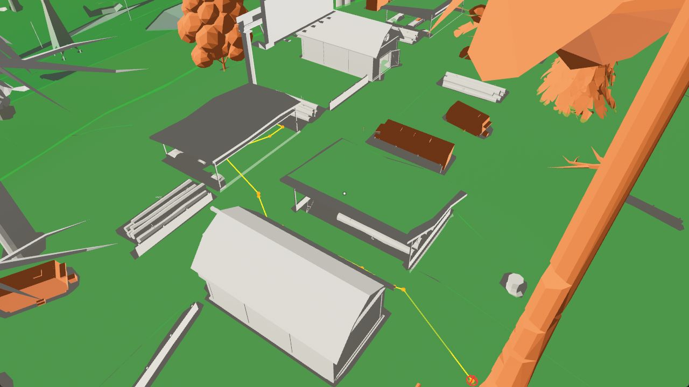
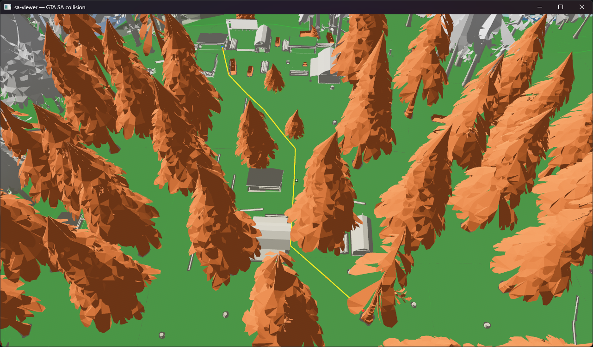

# RakClient — headless-клиент SA-MP 0.3.7 на Rust

RakClient — самодостаточный клиент SA-MP 0.3.7 (Rust + async Tokio) для взаимодействия с серверами без
запуска оригинальной игры, сделанный **прежде всего под Arizona RP**. Он проходит весь путь от
подключения до спавна, а дальше делает то, что вы ему напишете — работы, автоматизация, Android↔PC
чат-мост или любой другой сценарий на Lua.

Проект вырос из [RakSAMP Lite](https://www.blast.hk/threads/108052/) — лёгкого клиента, которым я
вдохновлялась и протокол которого покрыла целиком, — и идёт дальше: настоящий навмеш, нативный `walkTo`
и скрипт-хост на типизированном Luau (статическая типизация вместо динамического Lua).

Поведение вы описываете скриптами на Lua (Luau) поверх хост-API, повторяющего MoonLoader / SAMP.Lua:
скрипт перехватывает любые RPC и пакеты так же, как внутри настоящей игры. Под этим лежит транспорт
SA-MP «RakNet 3.x» (надёжный и упорядоченный поверх UDP), побайтовый шифр пакетов и машина состояний
подключения.

> Если вы только начинаете — это нормально. Ниже всё по шагам.

## Ходим как настоящий игрок

Бот двигается по настоящему навмешу, построенному из карты самого сервера, и ходит походками GTA SA:
шаг, бег и спринт, со скоростями и анимациями, снятыми с живого клиента игры
(`walkTo(x, y, z, "walk"|"jog"|"sprint")`). Скрипт просит его дойти до точки, бот сам строит путь в
обход построек и объектов и репортит соответствующий аналоговый ввод, скорость и анимацию, так что для
остальных на сервере он выглядит как обычный игрок.

Ниже — офлайн-визуализатор с лесопилкой Arizona RP, восстановленной из файлов игры, и маршрут по
навмешу (жёлтый) через двор. Зелёный ковёр — проходимая поверхность.





## С чего начать

Нужен установленный [Rust](https://rustup.rs/) (команды `cargo` и `rustc`). Собрать весь проект:

```sh
cargo build --workspace
```

Запустить клиент (имя бинарника — `rakclient`, а не `app`):

```sh
cargo run -p app -- --server <хост:порт> --nick ВашНик
```

Для серверов Arizona эмуляция (CEF и валидация) живёт в Lua, а не в Rust. Подгрузите папку с
лаунчером; тайминг отправки валидации задаёт сам скрипт через `wait()`:

```sh
cargo run -p app -- --server bumblebee.arizona-rp.com:7777 --nick ВашНик \
  --scripts-dir example_scripts
```

Подробный лог включается переменной окружения `RUST_LOG`:

```sh
RUST_LOG=info cargo run -p app -- --server <хост:порт> --nick ВашНик
# или raknet::transport=trace — чтобы видеть каждый пакет в hex
```

Скрипты подгружаются автоматически: все файлы `*.lua` и `*.luau` из папки скриптов (по умолчанию
`scripts/`, меняется флагом `--scripts-dir`). Чтобы включить нативный `walkTo`, укажите навмеш флагом
`--navmesh <файл.nav>`.

## Про пароли

- `--password` — это пароль самого сервера RakNet (на Arizona его нет, оставьте пустым). Пароль
  аккаунта сюда класть нельзя, сервер отклонит подключение (`ID_INVALID_PASSWORD`).
- Пароль аккаунта (диалог авторизации) ядро на Rust не вводит. Этим занимается ваш Lua-скрипт для
  Arizona: он видит диалог через `samp.events.onShowDialog` и отвечает через `sampSendDialogResponse`.

## Карта и навигация

Бот живёт на кастомной карте Arizona, поэтому карту можно разобрать и обойти офлайн-инструментами.

Один раз запечь мир и посмотреть его в 3D:

```sh
cargo run -p sa-map --bin samap -- scene <gta3.img> <data-dir> world.scene [objects.csv]
cargo run --release --manifest-path crates/sa-viewer/Cargo.toml -- world.scene [nav.nav]
```

Построить навмеш для региона (по нему бот и ходит через `walkTo`):

```sh
cargo run -p sa-nav --features build --bin navgen -- <gta3.img> <data-dir> region.nav [objects.csv]
```

Снять и разобрать трафик. `rakclient --pcap` пишет libpcap; скрипт MoonLoader
`tools/moonloader/rpc_capture_pcap.lua` пишет тот же формат с настоящего клиента. Оба открываются
нашими инструментами:

```sh
cargo run -p app --bin dissect -- capture.pcap   # разбор RPC/пакетов по датаграммам
cargo run -p app --bin objects -- capture.pcap   # выемка стримленных CreateObject
cargo run -p app --bin rpcscan -- capture.pcap   # перепись RPC/пакетов + поиск по телу
```

## Как устроен проект

Проект разбит на крейты (пакеты Rust), каждый отвечает за один слой, зависимости идут вниз:

| Крейт | За что отвечает |
| --- | --- |
| `samp-proto` | Чистые кодеки: `BitStream`, идентификаторы пакетов/RPC, типизированная (де)сериализация. Без сети. |
| `raknet` | Транспорт RakNet 3.x: шифр, слой надёжности, асинхронный `RakPeer`, плюс офлайн-разбор pcap. |
| `samp-client` | Машина состояний подключения, высокоуровневый `Client` и нативный `walkTo`. |
| `samp-script` | Хост Lua (Luau): нативные `bitStream` + `registerHandler` и типизированный порт `samp.events`. |
| `sa-map` | Разбор игровых данных (IMG, IDE, IPL, COL, DFF, streamer bin) и формат запечённой сцены. |
| `sa-nav` | Генерация навмеша (`navgen`) поверх `navmesh-recast`, формат `.nav` и поиск пути в рантайме. |
| `navmesh-recast` | Пайплайн сборки Recast (форк `rerecast`); пока машинно-локальный. |
| `sa-viewer` | Bevy-просмотрщик карты и навмеша. Свой воркспейс, чтобы Bevy не тянулся в основной gate. |
| `app` | Бинарник `rakclient`: настройки, логирование, плюс инструменты `dissect` / `objects` / `rpcscan`. |
| `test-support` | Только для тестов: моковый SA-MP сервер на localhost. |

## Проверка перед коммитом

В проекте есть «ворота качества», они должны проходить зелёными:

```sh
cargo fmt --all --check
cargo clippy --all-targets --all-features -- -D warnings
cargo test --workspace
```

## Лицензия

[WTFPL](LICENSE) — делайте с кодом что хотите.
